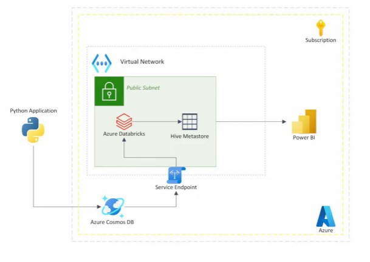
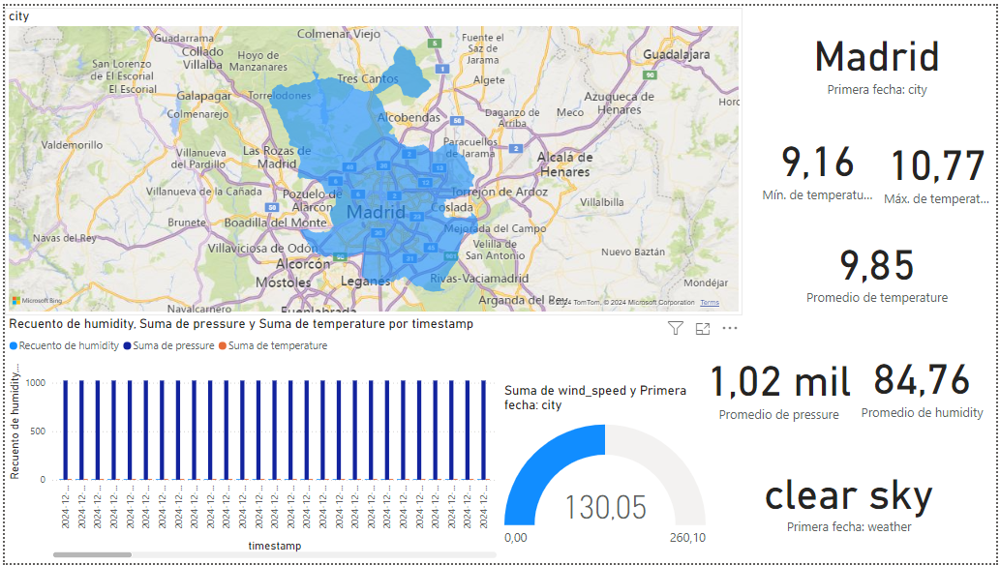

# Guía de Implementación: Azure Cosmos DB, Databricks y Power BI

Este README proporciona una guía paso a paso para configurar una arquitectura que integra **Azure Cosmos DB (API para MongoDB)**, **Azure Databricks** y **Power BI**. Este proyecto permite capturar datos meteorológicos, procesarlos y visualizarlos de manera eficiente usando servicios de Azure.

## Descripción General de la Arquitectura

- **Azure Cosmos DB** se utiliza para almacenar los datos meteorológicos. Utilizamos la API para MongoDB para la interoperabilidad con Databricks.
- **Azure Databricks** procesa los datos almacenados en Cosmos DB mediante Apache Spark y permite integrarlos con Power BI.
- **Power BI** se utiliza para visualizar los datos procesados, permitiendo la creación de informes y dashboards interactivos.
- **Virtual Network (VNet)** y **Service Endpoint** se configuran para garantizar una comunicación segura entre los servicios.

## Pasos para la Implementación
[Tutorial guiado con capturas](CosmosDB.pdf)

### 1. Creación de Recursos de Azure

1. **Crear el Grupo de Recursos** en Azure para organizar los componentes del proyecto.

2. **Crear Azure Cosmos DB**:
   - Selecciona **Azure Cosmos DB for MongoDB** y elige la opción **Serverless**.
   - En la configuración de la base de datos, selecciona "**Request unit - RU**" y deja el resto de las opciones por defecto.
   - Después del despliegue, ve a **Data Explorer** y crea una nueva **Base de Datos** y una **Colección**.

3. **Crear Virtual Network (VNet)**:
   - En el buscador de Azure escribe **Virtual Networks** y haz clic en **Create**.
   - Deja las configuraciones por defecto y crea la VNet.
   - Añade una subred para los servicios de Databricks.

### 2. Creación de Azure Databricks

1. **Crear un Recurso de Azure Databricks**:
   - En **Pricing Tier**, selecciona **Premium** para poder utilizar la integración con Power BI.
   - En **Networking**, selecciona "**Yes**" para asociarlo a la VNet creada previamente.

2. **Crear un Service Endpoint para Cosmos DB**:
   - Dentro de la VNet, selecciona la subred y habilita el **Service Endpoint** para **Microsoft.AzureCosmosDB**.

3. **Lanzar el Workspace de Databricks** y crear un clúster:
   - Crea un clúster de tipo **Single Node**.
   - En las **Advanced Options**, configura Spark con los siguientes parámetros:
     ```
     spark.master local[*, 4]
     spark.databricks.cluster.profile singleNode
     spark.mongodb.output.uri=<URI_de_salida_para_CosmosDB>
     spark.mongodb.input.uri=<URI_de_entrada_para_CosmosDB>
     ```

4. **Instalar Conector de Spark para MongoDB**:
   - Ve a la pestaña **Libraries** y haz clic en **Install New**.
   - Selecciona **Maven** y busca el paquete oficial de **mongo-spark connector**.

### 3. Captura de Datos Meteorológicos

1. **Registrarse en OpenWeather** y obtener una **API Key**.
2. Configura el script `weather_to_cosmodb.py`:
   - Reemplaza la `API_KEY` con la clave obtenida de OpenWeather.
   - Pega la **PRIMARY CONNECTION STRING** de Cosmos DB en el script y reemplaza `DB_NAME` y `COLLECTION_NAME` con los nombres correctos.
3. **Ejecutar el Script** para capturar y almacenar datos cada 20 segundos en Cosmos DB.
   - Para detener la captura de datos, usa `CTRL + C` en el terminal.

### 4. Creación del Entorno y Configuración de la Aplicación

1. **Instalar Dependencias**:
   - Asegúrate de tener **Python 3.x** instalado.
   - Crea un entorno virtual para gestionar las dependencias:
     ```
     python -m venv venv
     ```
   - Activa el entorno virtual:
     - En Windows:
       ```
       venv\Scripts\activate
       ```
     - En Linux/macOS:
       ```
       source venv/bin/activate
       ```
   - Instala las dependencias necesarias que se encuentran en `requirements.txt`:
     ```
     pip install -r requirements.txt
     ```

2. **Configurar Variables de Entorno**:
   - Crea un archivo `.env` para almacenar las credenciales sensibles como la **API Key** de OpenWeather y la cadena de conexión de Cosmos DB:
     ```
     API_KEY=tu_api_key_de_openweather
     COSMOSDB_CONNECTION_STRING=tu_cadena_de_conexion
     DB_NAME=cosmotestdb01
     COLLECTION_NAME=pruebadbkcosmosdb
     ```

3. **Ejecutar la Aplicación**:
   - Ejecuta el script para comenzar a recopilar datos meteorológicos y almacenarlos en Cosmos DB:
     ```
     python app.py
     ```
   - El script obtendrá datos meteorológicos cada 20 segundos y los almacenará en la base de datos de Cosmos DB.

### 5. Conectar Databricks con Power BI

1. **Crear un DataFrame** en Databricks con los datos meteorológicos y almacenar el resultado en el **Hive Metastore**.
2. **Utilizar Partner Connect** para Power BI desde Databricks:
   - Ve a **Partner Connect** en Databricks y selecciona **Power BI**.
   - Descarga el **archivo de conexión** (`.pbids`) y ábrelo con Power BI Desktop.
   - Utiliza **Azure Active Directory** para autenticarte y cargar los datos en Power BI.

### 6. Visualización de Datos en Power BI

1. En Power BI, carga la tabla (`powerbitable`) y empieza a crear **visualizaciones** interactivas de los datos meteorológicos.
2. Dedica tiempo a experimentar con diferentes **gráficos** y **plots** para entender mejor los datos.



[Dashboard](weather_dashboard_madrid.pbit)

### 7. Consideraciones Finales

- **Seguridad**: Asegúrate de eliminar las **claves sensibles** del código y utiliza archivos `.env` para proteger las credenciales.
- **Costos**: Una vez finalizado el proyecto, elimina todos los recursos creados en Azure para evitar cargos innecesarios.

## Recursos Adicionales
- [OpenWeather API](https://openweathermap.org/api)
- Documentación oficial de [Azure Cosmos DB](https://docs.microsoft.com/en-us/azure/cosmos-db/)
- Documentación de [Azure Databricks](https://docs.microsoft.com/en-us/azure/databricks/)

Si tienes alguna duda o necesitas asistencia adicional, no dudes en contactarme.

